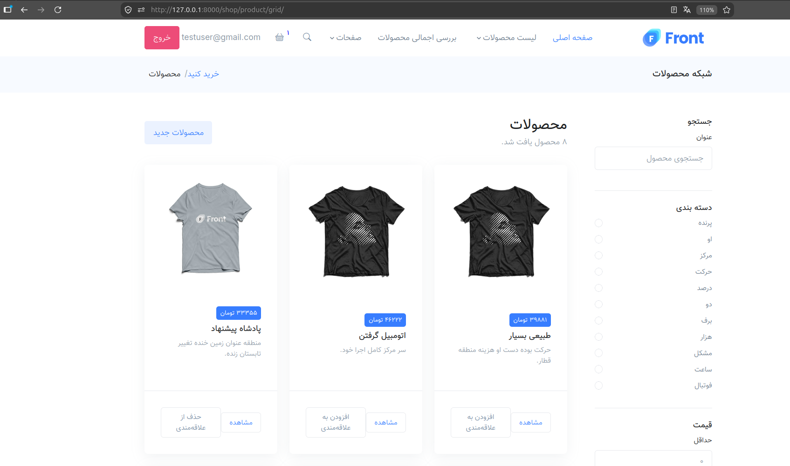
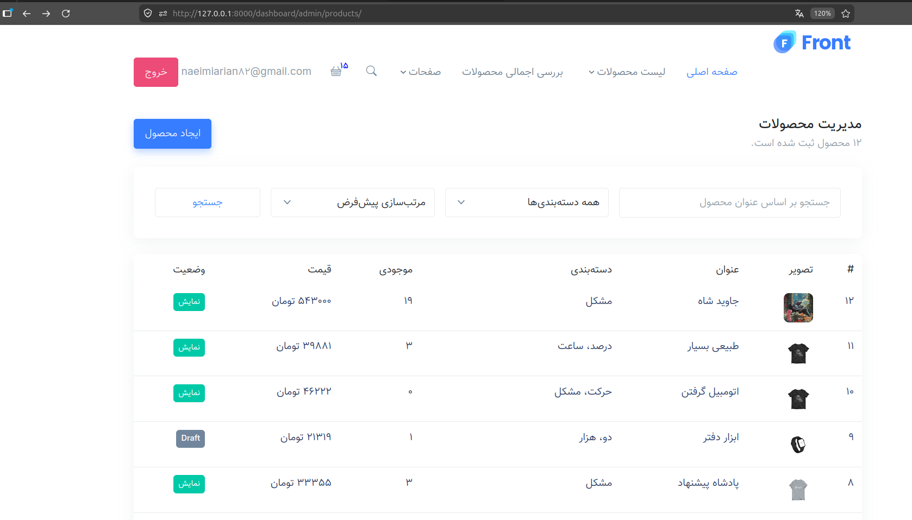

# Django Shop


[](https://github.com/Arian-nmi/Django-Shop/actions/workflows/django-ci.yml)

A full-featured e-commerce project built with Django.

The project includes product management, shopping cart, checkout,
Zarinpal sandbox payment, customer and admin dashboards, product reviews,
JWT-protected REST APIs, Redis caching, Celery background tasks,
and GitHub Actions CI.

> A production-inspired Django e-commerce application built to explore scalable architecture, modern development practices, and real-world backend workflows.

---

## Screenshots

### Storefront



### Admin Dashboard



---

## Features

### Storefront

- Product grid with search, category filtering, price filtering, sorting, and pagination
- Product detail page with extra images and related products
- Wishlist support
- Product reviews and rating system
- Published and draft product statuses
- Average rating calculation for products

### Cart and Checkout

- Session-based cart for guest users
- Database cart for authenticated users
- Cart synchronization after login
- Product stock validation
- Coupon validation
- Checkout with address snapshot
- Order item price snapshot
- Zarinpal Sandbox payment flow
- Successful and failed payment handling

### Payment and Background Tasks

- Zarinpal v4 payment request and verification
- Payment status tracking
- Order status tracking
- Stock update after successful payment
- Coupon consumption after successful payment
- Redis as Celery broker
- Asynchronous order confirmation emails
- SMTP4Dev support for local email testing

### Customer Dashboard

- Profile editing
- Password change
- Profile image upload
- Address management
- Order history
- Order details and invoices
- Wishlist management

### Admin Dashboard

- Product management
- Product image management
- Order management and invoices
- Coupon management
- Review moderation

### REST API

- Versioned API under `/api/v1/`
- JWT access and refresh tokens
- Public product and category APIs
- JWT-protected cart API
- JWT-protected wishlist API
- JWT-protected order API
- Pagination, search, filtering, and safe ordering
- Ownership checks for private resources

### Quality

- Automated API tests
- GitHub Actions CI
- PostgreSQL test database in CI
- Redis service in CI
- Django system checks and migration checks

---

## Tech Stack

| Area | Tools |
| --- | --- |
| Backend | Django |
| REST API | Django REST Framework |
| Authentication | JWT with SimpleJWT |
| Database | PostgreSQL |
| Background Tasks | Celery |
| Message Broker / Cache | Redis |
| Async Task Results | django-celery-results |
| Payment Gateway | Zarinpal Sandbox |
| Email Testing | SMTP4Dev |
| Containerization | Docker and Docker Compose |
| Testing | Django Test Framework and DRF APITestCase |
| CI | GitHub Actions |

---

## Project Architecture

```text
core/
├── accounts/        # Custom user, profile, authentication
├── shop/            # Products, categories, wishlist, public APIs
├── cart/            # Session cart, database cart, cart APIs
├── order/           # Addresses, coupons, orders, checkout, order APIs
├── payment/         # Zarinpal payment flow
├── review/          # Product reviews and rating
├── dashboard/       # Customer and admin dashboards
├── api/             # API root, JWT routes, shared pagination
└── core/            # Settings, URLs, Celery configuration
```

---

## Getting Started

1. Clone the repo and copy `envs/dev/.env.sample` to `envs/dev/.env`
2. Fill in the required environment variables (see the sample file)
3. Run:
   ```bash
   docker-compose up --build
   docker-compose exec backend python manage.py migrate
   docker-compose exec backend python manage.py createsuperuser
   ```
4. Visit `http://localhost:8000`

---

## Author

Built by [Arian Naeimi](https://github.com/Arian-nmi).
- LinkedIn: [Arian Naeimi](https://www.linkedin.com/in/arian-naeimi/)
